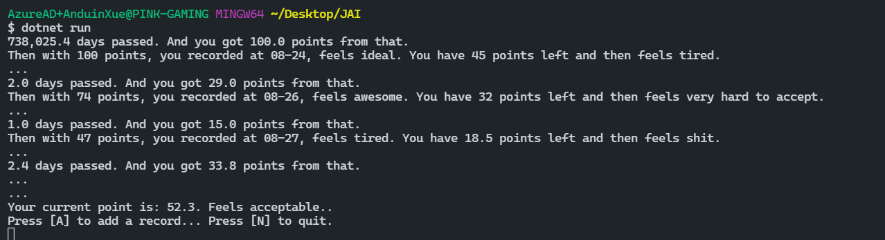

# 某种不可描述的统计器

(我很纯洁的。这是送给我那些污污的粉丝的小礼物)

这个项目通过一些简单的数学模型，通过记录你每次感受快乐的时间，计算你的当前身体状态。从而帮助用户订立科学健康的行为周期，避免身体的过度消耗。。。

（当然，整个项目完全就是一个玩笑……我总共花了半个下午就写完了。。其实我坦白我只是想找个乐子而已……）

## 如何运行

直接用 Visual Studio 双击打开，F5 运行即可。

或者你可以自己用 .NET SDK 把它编译成exe来用。

## 如何使用

每次你需要记忆一些生活中的舒适事件时，打开它，按下A键即可。

如果你只需要查询一下，你当前的身体状态如何，打开它，按下N键即可。

## 注意事项

刚刚开始用的时候，由于没有历史数据，会不太准。

你可以手工编辑`records.json`，来手工记录快乐。

